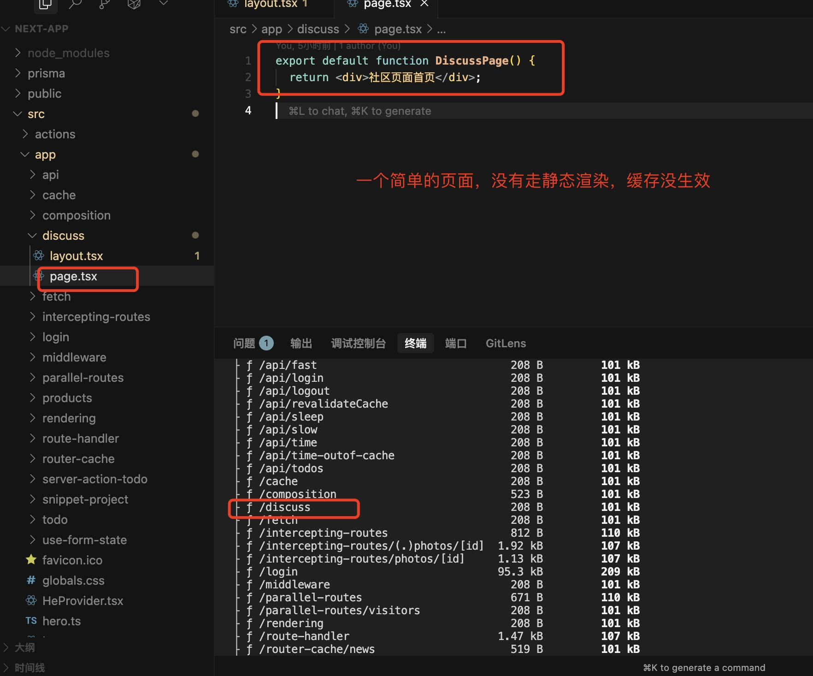
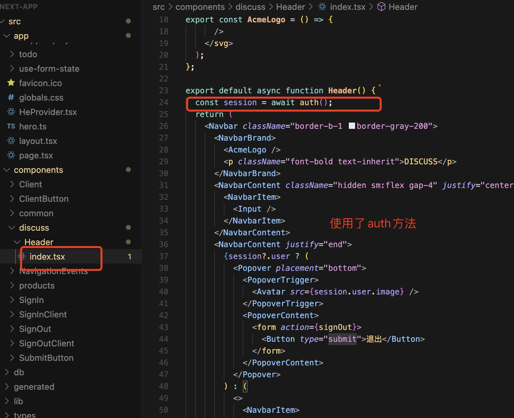

## 处理 auth 方法打包时的隐患

理论上，discuss/page.tsx 是完全可以走静态渲染，全路由缓存的。但实际上是走的动态渲染，即每次请求都会重新生成页面，如下所示。
这对性能是不好的。

为什么 discuss/page.tsx 的缓存会失效？

实际上，这是因为我们在 discuss/layout.tsx 引入了 Header 组件，Header 组件内部用到了 auth 方法，如下图所示：

而 auth 方法内部用到了 cookie 相关的操作。使用了 cookie 相关的动态方法，是会导致缓存失效。所以我们在 layout 里面引入了 Header，会导致 discuss 下面所有的页面的缓存都会失效。

## 解决方法

我们知道，在 Client Component 中，我们可以使用 useSession 方法获取用户信息。useSession 内部并不会涉及到 cookie 相关的操作，它内部是通过向后端发请求拿到用户信息。

因此，我们的解决思路是，可以抽离一个客户端组件，这个组件专门用来处理获取用户信息的逻辑。

所以这里封装一个 HeaderAuth 组件。
