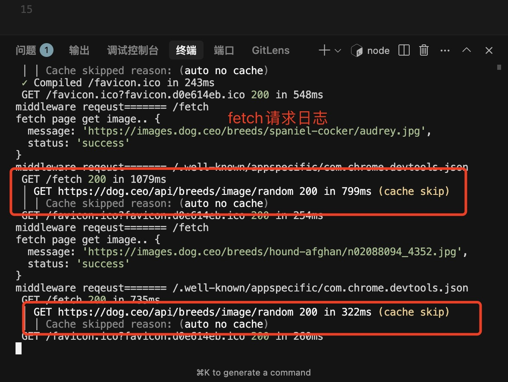

## Fetch

Next.js 扩展了原生的 fetch API，允许我们为服务器上的每个 fetch 请求配置缓存和重新验证行为。React 扩展了 fetch 以在渲染 React 组件树时自动记住 fetch 请求。

### 一、Next 14

默认情况下，Next.js 会自动将 fetch 的返回值缓存在服务器上的 Data Cache 中。这意味着可以在构建时或请求时获取数据，缓存数据，并在每个数据请求中重复使用。

但是也有例外，在以下情况下不会缓存 fetch 请求：

1. 在 server action 中使用

2. 在使用 post 方法的 route handler 中使用

可以通过在 next config 中开启 fetch 请求的请求日志，方便观察 fetch 请求的缓存效果

在 next.config.ts 中：

```js
const nextConfig = {
  logging: {
    fetches: {
      fullUrl: true,
    },
  },
};
```



#### Revalidating Data 重新验证数据

重新验证是清除 Data Cache 并重新获取最新数据的过程。当数据发生更改并且希望确保显示最新信息时，这非常有用

可以通过两种方式重新验证缓存的数据：

- 1.基于时间的重新验证：在经过一定时间后自动重新验证数据。这对于不经常更改且新鲜度不那么重要的数据非常有用
- 2.按需重新验证：根据事件（比如表单提交）手动重新验证数据。按需重新验证可以使用基于标签或基于路径的方法一次重新验证数据组。当希望确保尽快显示最新数据时（例如，当无头 CMS 中的内容更新时），这非常有用

基于时间的重新验证：

```js
fetch('https://...', { next: { revalidate: 3600 } });
```

或者，要重新验证 route segment 中的所有 fetch 请求，可以使用 segment config options，即在 page.tsx 中导出 revalidate 配置

```tsx
export const revalidate = 3600;
```

按需重新验证的两种方式：

- 1.基于路径的验证：调用 next/cache 提供的 revalidatePath 方法。比如 src/app/api/revalidateCache 的用法
- 2.基于标签的验证：

比如可以通过在 fetch 请求中配置 next.tags 打标签:

```js
export async function GET() {
  const r = await fetch('', {
    next: {
      tags: ['dog'],
    },
  });
  const data = await r.json();
  return NextResponse.json(data);
}
```

然后调用 next/cache 提供的 revalidateTag 方法验证，比如 src/app/api/revalidateCache 的用法
