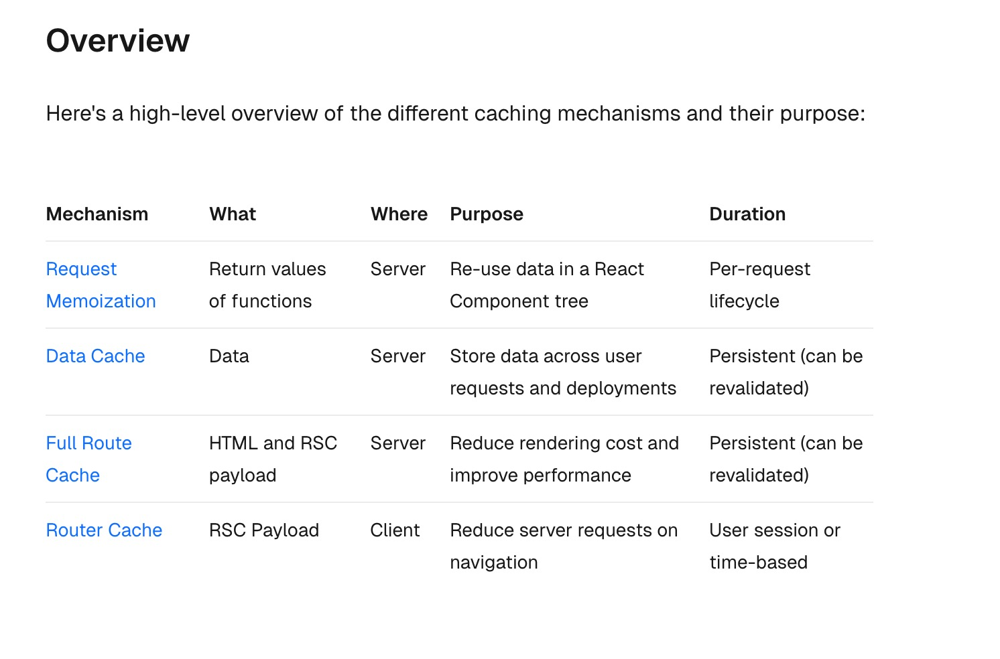

## Next.js 中的缓存

Next.js 通过缓存渲染工作和数据请求来提高应用程序的性能并降低成本。本篇文章介绍 Next.js 在后台的工作原理。

Next.js 存在 4 中缓存：

- 1. Request Memoization。请求记忆。缓存在服务端
- 2. Data Cache。数据缓存。缓存在服务端
- 3. Full Route Cache。完整路由缓存。缓存在服务端
- 4. Router Cache 路由器缓存。缓存在客户端



### Request Memoization

React 扩展了 fetch API 以自动记住具有相同 URL 和选项的请求。这意味着可以在 React 组件树中的多个位置为相同的数据调用 fetch 函数，而只执行一次。

例如，如果我们需要在一条路由中使用相同的数据（例如，在 Layout，Page 和多个组件中），不必在树的顶部获取数据，并在组件之间转发 props。相反，可以在需要数据的组件中获取数据，而无需担心通过网络对相同数据发出多个请求对性能的影响。

> 请求记忆是 React 的一个功能，而不是 Next.js 的功能。同时请求记忆仅适用于 fetch 请求中的 GET 方法

### Data Cache 数据缓存

Next.js 具有内置的数据缓存，可在传入的服务器请求和部署中保留数据获取的结果。这是可能的，因为 Next.js 扩展了原生的 fetch api，以允许服务器上的每个请求设置自己的持久缓存语义

### Full Route Cache。完整路由缓存

Next.js 在构建时自动渲染和缓存路由，这是一项优化，允许我们为每个请求提供缓存的路由，而不是在服务器上呈现，从而加快页面加载速度。

Next.js 的默认行为是将路由的渲染结果(React Server Component Payload 和 HTML)缓存在服务器上。这适用于在构建时或重新验证期间静态渲染的路由

### Router Cache 路由器缓存

Next.js 有一个内存中的客户端缓存，用于在用户会话期间存储 React Server 组件有效负载，按各个路由段拆分。这称为 Router Cache

当用户在路由之间导航时，Next.js 会缓存访问过的路由段，并预取用户可能导航到的路由(基于<Link>其视区中的组件)

当手动刷新页面时，会清除客户端缓存

### 注意

`await headers()`放在 fetch 前面，会导致 fetch 缓存失效，但是 fetch 记忆缓存还是存在

```tsx
import { headers } from 'next/headers';

const fetchImg = async () => {
  const r = await fetch('https://dog.ceo/api/breeds/image/random');
  return r.json();
};

export default async function Page() {
  await headers();
  const obj = await fetchImg();
  const obj1 = await fetchImg();
  const obj2 = await fetchImg();
  console.log('cache....');
  return (
    <div>
      
      
      
    </div>
  );
}
```

`await headers()`放在 fetch 后面，不会导致 fetch 缓存失效

```tsx
import { headers } from 'next/headers';

const fetchImg = async () => {
  const r = await fetch('https://dog.ceo/api/breeds/image/random');
  return r.json();
};

export default async function Page() {
  const obj = await fetchImg();
  const obj1 = await fetchImg();
  const obj2 = await fetchImg();
  await headers();

  console.log('cache....');
  return (
    <div>
      
      
      
    </div>
  );
}
```

在 Layout.tsx 中，注意看下 NavigationEvents 的使用，<NavigationEvents>包裹在 Suspense 组件中，因为 useSearchParams()会导致客户端渲染到最近的 Suspense 组件。
