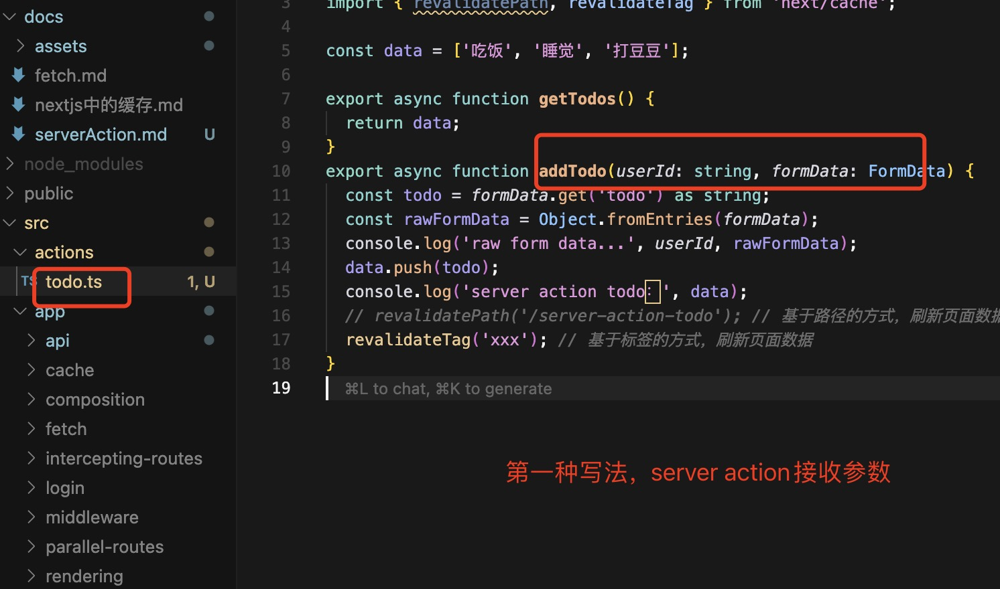

## Server Action

服务器操作是在服务器上执行的异步函数。它们可以在 Server 和 Client
Components 中使用，以处理 Next.js 应用程序中的表单提交和数据更改。

### 约定

可以使用 React 'use server' 定义 Server Action。可以将该指令放在异步函数的顶部，以将该函数标记为 Server Action，或放在单独文件的顶部，以将该文件的所有导出标记为 Server Actions

如果需要在客户端组件中调用服务器操作，需要创建一个新文件并在其顶部添加 use server 指令，文件中的所有函数都将被标记为 Server Actions，可以在 client 和 server components 中重复使用

### 为什么需要 Server Action

我们以 TODO List 的案例来分析一下，可以通过在 src/app/todo 下面看看传统 API 方式实现的 todo list

### form

React 对 form 的 action 做了增强，如果禁用网页的 js 能力，也一样可以提交表单

### Server Action 注意点

#### 第一点：下面两种写法是一样的：

```tsx
// form action的写法比较常见
<form action={addTodo}>
  <input className="border border-red-600" type="text" name="todo" />
  <button type="submit">提交</button>
</form>

// 或者 button form action，这种写法比较少见，了解即可
<form>
  <input className="border border-red-600" type="text" name="todo" />
  <button formAction={addTodo} type="submit">提交</button>
</form>
```

#### 第二点

通过`const todo = formData.get('todo') as string;` 获取数据的方式不够优雅，如果有多个字段，就需要每个字段都调用一次`formData.get()`方法。所以 Next.js 也提供了`Object.fromEntries`方法获取所有字段：

```ts
const rawFormData = Object.fromEntries(formData);
```

但这种方式获取的 formData 会包含一个`$ACTION_`的属性


为什么会有这个`$ACTION_`开头的属性？这就是因为当我们使用 form 标签结合 server action 使用的时候，后端为了区分是哪个 server action，react 会自动在 form 标签内部插入一个隐藏的 input 标签


#### 第三点：如何传递额外的数据

比如如何传递 userid？

第一种写法：




第二种写法，通过 bind 方法：


addTodo 接收参数的方法和上面一样：


